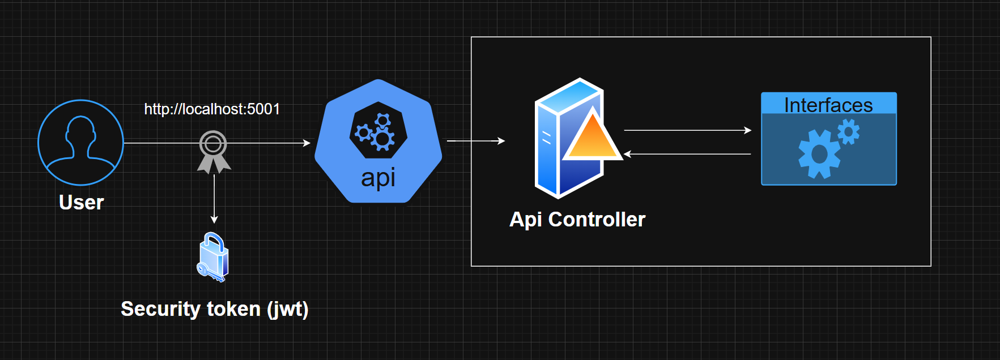

## Bitbucket API
This repository contains a REST API connected to Bitbucket that provides metrics and details about the team's activity on Bitbucket. It´s a copy of https://github.com/agustinafassina/BitbucketApi.Net10

## 📄 API Reference
### Diagram


### 🔌 Bitbucket Integration
The API is connected to Bitbucket to retrieve repository and commit information, and generate metrics.

#### Bitbucket Configuration
Add your credentials in `appsettings.json` or `appsettings.Development.json`:

**Option 1: Atlassian API Token (Recommended)**
```json
{
  "Bitbucket": {
    "BaseUrl": "https://api.bitbucket.org/2.0",
    "Username": "your-email@example.com",
    "ApiToken": "your-api-token"
  }
}
```
*Note: With API Token you do NOT need a password. The token acts as the password.*

**Option 2: App Password**
```json
{
  "Bitbucket": {
    "BaseUrl": "https://api.bitbucket.org/2.0",
    "Username": "your-username",
    "AppPassword": "your-app-password"
  }
}
```

**How to get credentials:**

- **Atlassian API Token (Recommended):**
  1. Go to https://id.atlassian.com/manage-profile/security/api-tokens
  2. Click on "Create API token"
  3. Give it a descriptive name
  4. Copy the generated token (only shown once)
  5. Use your Atlassian email as `Username` and the token as `ApiToken`
  6. **You do NOT need a password** - the token already acts as the password

- **App Password:**
  1. Go to your Bitbucket profile
  2. Personal settings → App passwords
  3. Create a new app password with repository read permissions

### 📊 Metrics Endpoints

#### GET `/api/v1/Metrics/commits-by-person`
Gets commits grouped by person for a specific repository.

**Query Parameters:**
- `workspace` (required): Bitbucket workspace
- `repository` (required): Repository name
- `branch` (optional): Specific branch
- `startDate` (optional): Start date to filter commits (format: yyyy-MM-dd)
- `endDate` (optional): End date to filter commits (format: yyyy-MM-dd)

**Example:**
```
GET /api/v1/Metrics/commits-by-person?workspace=my-workspace&repository=my-repo&branch=main&startDate=2024-01-01&endDate=2024-12-31
```

**Response:** `List<CommitsByPersonDto>`
```json
[
  {
    "personName": "John Doe",
    "personEmail": "john.doe@example.com",
    "totalCommits": 45,
    "commits": [
      {
        "hash": "abc123def456",
        "message": "Fix bug in authentication",
        "date": "2024-01-15T10:30:00Z",
        "repository": "my-repo",
        "branch": "main"
      }
    ]
  }
]
```

#### GET `/api/v1/Metrics/commits-by-person/{email}`
Gets commits from a specific person by their email.

**Query Parameters:**
- `workspace` (required): Bitbucket workspace
- `repository` (required): Repository name
- `branch` (optional): Specific branch
- `startDate` (optional): Start date
- `endDate` (optional): End date

**Example:**
```
GET /api/v1/Metrics/commits-by-person/john.doe@example.com?workspace=my-workspace&repository=my-repo
```

**Response:** `CommitsByPersonDto`
```json
{
  "personName": "John Doe",
  "personEmail": "john.doe@example.com",
  "totalCommits": 45,
  "commits": [
    {
      "hash": "abc123def456",
      "message": "Fix bug in authentication",
      "date": "2024-01-15T10:30:00Z",
      "repository": "my-repo",
      "branch": "main"
    }
  ]
}
```

### 🔍 Bitbucket Endpoints

#### GET `/api/v1/Bitbucket/commits`
Gets all commits from a repository.

**Query Parameters:**
- `workspace` (required): Bitbucket workspace
- `repository` (required): Repository name
- `branch` (optional): Specific branch
- `limit` (optional): Limit of commits to return

**Example:**
```
GET /api/v1/Bitbucket/commits?workspace=my-workspace&repository=my-repo&branch=main&limit=50
```

**Response:** `List<CommitDto>`
```json
[
  {
    "hash": "abc123def456",
    "message": "Fix bug in authentication",
    "author": {
      "name": "John Doe",
      "email": "john.doe@example.com",
      "userId": "12345678-1234-1234-1234-123456789abc",
      "displayName": "John Doe"
    },
    "date": "2024-01-15T10:30:00Z",
    "repository": "my-repo",
    "branch": "main"
  }
]
```

#### GET `/api/v1/Bitbucket/commits/{commitHash}`
Gets a specific commit by its hash.

**Query Parameters:**
- `workspace` (required): Bitbucket workspace
- `repository` (required): Repository name

**Example:**
```
GET /api/v1/Bitbucket/commits/abc123def456?workspace=my-workspace&repository=my-repo
```

**Response:** `CommitDto`
```json
{
  "hash": "abc123def456",
  "message": "Fix bug in authentication",
  "author": {
    "name": "John Doe",
    "email": "john.doe@example.com",
    "userId": "12345678-1234-1234-1234-123456789abc",
    "displayName": "John Doe"
  },
  "date": "2024-01-15T10:30:00Z",
  "repository": "my-repo",
  "branch": "main"
}
```

#### GET `/api/v1/Bitbucket/repositories`
Gets all repositories from a workspace.

**Query Parameters:**
- `workspace` (required): Bitbucket workspace

**Example:**
```
GET /api/v1/Bitbucket/repositories?workspace=my-workspace
```

**Response:** `List<RepositoryDto>`
```json
[
  {
    "name": "my-repository",
    "slug": "my-repository",
    "workspace": "my-workspace",
    "fullName": "my-workspace/my-repository"
  }
]
```

### 🔐 Authorization
It implements JWT authentication to secure endpoints, validating issuer, audience, and signature, allowing access only to authorized users.
```
[Authorize(AuthenticationSchemes = "Auth0App1")]
[Authorize(AuthenticationSchemes = "Auth0App2")]
```
Environment variables setting (auth0 in this case)
```
  "Auth0App1": {
    "Issuer": "https://test.asdasdasd.auth0/",
    "Audience": "Test-Api"
  },
  "Auth0App2": {
    "Issuer": "AgusFassina",
    "Audience": "Agusfassina"
  }
```

### Dotnet build and run
```
dotnet build
dotnet run
```

### Docker build and run

```
# Docker build
docker build -f Dockerfile -t api .
# Docker run in the port 8787
docker run -d -p 8787:80 -e "ASPNETCORE_ENVIRONMENT=Development" --name api api
# api tests http://localhost:8787/swagger/index.html
```

---

## API de Bitbucket
Este repositorio contiene una API REST conectada a Bitbucket que proporciona métricas y detalles sobre la actividad del equipo en Bitbucket. Es una copia de https://github.com/agustinafassina/BitbucketApi.Net10

## 📄 Referencia de API
### Diagrama


### 🔌 Integración con Bitbucket
La API está conectada a Bitbucket para obtener información de repositorios y commits, y generar métricas.

#### Configuración de Bitbucket
Agrega tus credenciales en `appsettings.json` o `appsettings.Development.json`:

**Opción 1: API Token de Atlassian (Recomendado)**
```json
{
  "Bitbucket": {
    "BaseUrl": "https://api.bitbucket.org/2.0",
    "Username": "tu-email@ejemplo.com",
    "ApiToken": "tu-api-token"
  }
}
```
*Nota: Con API Token NO necesitas password. El token actúa como contraseña.*

**Opción 2: App Password**
```json
{
  "Bitbucket": {
    "BaseUrl": "https://api.bitbucket.org/2.0",
    "Username": "tu-usuario",
    "AppPassword": "tu-app-password"
  }
}
```

**Cómo obtener credenciales:**

- **API Token de Atlassian (Recomendado):**
  1. Ve a https://id.atlassian.com/manage-profile/security/api-tokens
  2. Haz clic en "Create API token"
  3. Dale un nombre descriptivo
  4. Copia el token generado (solo se muestra una vez)
  5. Usa tu email de Atlassian como `Username` y el token como `ApiToken`
  6. **NO necesitas password** - el token ya actúa como contraseña

- **App Password:**
  1. Ve a tu perfil de Bitbucket
  2. Personal settings → App passwords
  3. Crea un nuevo app password con permisos de lectura en repositorios

### 📊 Endpoints de Métricas

#### GET `/api/v1/Metrics/commits-by-person`
Obtiene commits agrupados por persona para un repositorio específico.

**Query Parameters:**
- `workspace` (requerido): Workspace de Bitbucket
- `repository` (requerido): Nombre del repositorio
- `branch` (opcional): Rama específica
- `startDate` (opcional): Fecha de inicio para filtrar commits (formato: yyyy-MM-dd)
- `endDate` (opcional): Fecha de fin para filtrar commits (formato: yyyy-MM-dd)

**Ejemplo:**
```
GET /api/v1/Metrics/commits-by-person?workspace=mi-workspace&repository=mi-repo&branch=main&startDate=2024-01-01&endDate=2024-12-31
```

**Respuesta:** `List<CommitsByPersonDto>`
```json
[
  {
    "personName": "Juan Pérez",
    "personEmail": "juan.perez@example.com",
    "totalCommits": 45,
    "commits": [
      {
        "hash": "abc123def456",
        "message": "Fix bug in authentication",
        "date": "2024-01-15T10:30:00Z",
        "repository": "mi-repo",
        "branch": "main"
      }
    ]
  }
]
```

#### GET `/api/v1/Metrics/commits-by-person/{email}`
Obtiene commits de una persona específica por su email.

**Query Parameters:**
- `workspace` (requerido): Workspace de Bitbucket
- `repository` (requerido): Nombre del repositorio
- `branch` (opcional): Rama específica
- `startDate` (opcional): Fecha de inicio
- `endDate` (opcional): Fecha de fin

**Ejemplo:**
```
GET /api/v1/Metrics/commits-by-person/juan.perez@example.com?workspace=mi-workspace&repository=mi-repo
```

**Respuesta:** `CommitsByPersonDto`
```json
{
  "personName": "Juan Pérez",
  "personEmail": "juan.perez@example.com",
  "totalCommits": 45,
  "commits": [
    {
      "hash": "abc123def456",
      "message": "Fix bug in authentication",
      "date": "2024-01-15T10:30:00Z",
      "repository": "mi-repo",
      "branch": "main"
    }
  ]
}
```

### 🔍 Endpoints de Bitbucket

#### GET `/api/v1/Bitbucket/commits`
Obtiene todos los commits de un repositorio.

**Query Parameters:**
- `workspace` (requerido): Workspace de Bitbucket
- `repository` (requerido): Nombre del repositorio
- `branch` (opcional): Rama específica
- `limit` (opcional): Límite de commits a retornar

**Ejemplo:**
```
GET /api/v1/Bitbucket/commits?workspace=mi-workspace&repository=mi-repo&branch=main&limit=50
```

**Respuesta:** `List<CommitDto>`
```json
[
  {
    "hash": "abc123def456",
    "message": "Fix bug in authentication",
    "author": {
      "name": "Juan Pérez",
      "email": "juan.perez@example.com",
      "userId": "12345678-1234-1234-1234-123456789abc",
      "displayName": "Juan Pérez"
    },
    "date": "2024-01-15T10:30:00Z",
    "repository": "mi-repo",
    "branch": "main"
  }
]
```

#### GET `/api/v1/Bitbucket/commits/{commitHash}`
Obtiene un commit específico por su hash.

**Query Parameters:**
- `workspace` (requerido): Workspace de Bitbucket
- `repository` (requerido): Nombre del repositorio

**Ejemplo:**
```
GET /api/v1/Bitbucket/commits/abc123def456?workspace=mi-workspace&repository=mi-repo
```

**Respuesta:** `CommitDto`
```json
{
  "hash": "abc123def456",
  "message": "Fix bug in authentication",
  "author": {
    "name": "Juan Pérez",
    "email": "juan.perez@example.com",
    "userId": "12345678-1234-1234-1234-123456789abc",
    "displayName": "Juan Pérez"
  },
  "date": "2024-01-15T10:30:00Z",
  "repository": "mi-repo",
  "branch": "main"
}
```

#### GET `/api/v1/Bitbucket/repositories`
Obtiene todos los repositorios de un workspace.

**Query Parameters:**
- `workspace` (requerido): Workspace de Bitbucket

**Ejemplo:**
```
GET /api/v1/Bitbucket/repositories?workspace=mi-workspace
```

**Respuesta:** `List<RepositoryDto>`
```json
[
  {
    "name": "mi-repositorio",
    "slug": "mi-repositorio",
    "workspace": "mi-workspace",
    "fullName": "mi-workspace/mi-repositorio"
  }
]
```

### 🔐 Autorización
Implementa autenticación JWT para proteger los endpoints, validando issuer, audience y firma, permitiendo acceso solo a usuarios autorizados.
```
[Authorize(AuthenticationSchemes = "Auth0App1")]
[Authorize(AuthenticationSchemes = "Auth0App2")]
```
Configuración de variables de entorno (auth0 en este caso)
```
  "Auth0App1": {
    "Issuer": "https://test.asdasdasd.auth0/",
    "Audience": "Test-Api"
  },
  "Auth0App2": {
    "Issuer": "AgusFassina",
    "Audience": "Agusfassina"
  }
```

### Dotnet build and run
```
dotnet build
dotnet run
```

### Docker build and run

```
# Docker build
docker build -f Dockerfile -t api .
# Docker run in the port 8787
docker run -d -p 8787:80 -e "ASPNETCORE_ENVIRONMENT=Development" --name api api
# api tests http://localhost:8787/swagger/index.html
```
